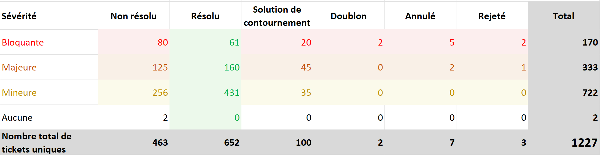
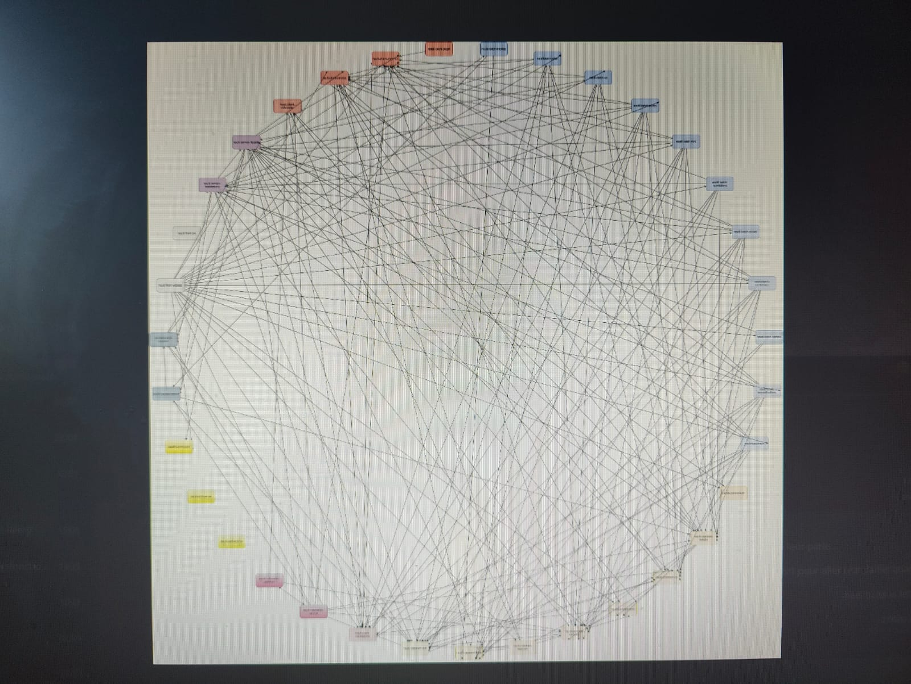

# **Audit d'application**

Article écrit par Salim CHAMI [@salimchami](https://github.com/salimchami/) (15 mn de lecture).

> **Mon Manager N+3 Laure** : "Salut ! tu voudrais faire l'audit de code d'une application ?"  
**Moi** : "Salut Laure ! quels problèmes ils ont ?"  
**Laure** : "Je ne sais pas trop.
> Le PM m'a dit qu'ils avaient de gros problèmes de qualité de code...
> Je lui dis que t'es d'accord ?"  
**Moi** : "Et bien, il faut que je me dégage du temps parce que là, je suis sur l'application X, je travaille aussi sur
> la scalabilité de l'application Y. D'ailleurs, je crois qu'il y a un problème dans nos process de déploiement
> auto..."  
**Laure**: "Oui... il faut qu'on en parle.
> Je t'envoie un mail avec Rémy le PM de l'application en copie ?
> Il t'enverra les infos !"  
**Moi**: "Ok. avec plaisir."  
**Laure** : "Merci, c'est sympa !"

Étant convaincu que j'allais faire un audit de code, une sorte de code review mais un peu plus long que d'habitude, je
me suis mis à programmer une journée ou deux la semaine suivante pour le faire.

Le lendemain matin, j'ai reçu un mail de Léo le PO me présentant en deux phrases le métier de l'application et me
demandant les prérequis pour réaliser l'audit.

Avec mon entrain habituel, je lui répondis quelques secondes après pour lui lister les actions nécessaires pour le
réaliser :

- L'objectif et la population cibles de l'audit
- Le domaine métier avec une description succincte des principales fonctionnalités
- Les cas d'utilisations des fonctionnalités les plus pertinentes
- Accès Git
- Accès CI/CD
- Accès outils de documentation
- Accès outils de monitoring

J'ai écrit ce mail en me disant que j'avais sûrement oublié quelque chose...
Je me dis qu'il serait intéressant aussi que j'aie un entretien avec un tech.

> **Moi, sur le chat de l'entreprise** : "Léo, s'il te plait, il faudrait aussi que je parle à un tech de l'équipe.
> Ne serait-ce que pour démarrer l'application en local."  
**Léo** : "Ils ne sont pas au courant de l'audit.
> C'est assez compliqué..."  
**Moi**: "Ah oui, il faudrait au moins en parler à une personne tech.
> Bon Ok. pas de problème.
> Merci!"

Je change d'onglet et contacte Rémy pour lui demander des explications supplémentaires.

> **Moi** : "Salut Rémy.
> Je voudrais s'il te plaît avoir plus d'infos à propos de l'audit.
> On m'a dit que je ne pouvais pas contacter l'équipe de dév.
> Je me demandais donc à qui il va être destiné ?"  
**Rémy une heure après** : "Salut !
> On voudrait transférer le projet à une autre équipe et comme, contractuellement, c'est difficile avec la société
> travaillant sur l'appli actuellement, il nous faudrait un audit pour rompre le contrat.
> Et une stratégie de remédiation aussi !"  
**Moi, dans mes pensées** : "Ah !
> Un audit sans parler à l'équipe de dév...
> Comme quand on interdit au développeur de contacter le PO..."

Cette fiction peut être bien réelle dans les entreprises.
Les managers, les PM/PO considèrent le logiciel comme une boîte noire.
Et en tant qu'auditeur, nous devons également les aider à éclaircir les processus de développement.
Par ailleurs, si un audit est réalisé sur une application, l'équipe de dév devrait être la première dans la boucle, et
doit avoir le recul nécessaire pour accepter cet audit.
Si ce n'est-elle qui en fait la demande.

Dans cet article, je vais tenter d'expliquer ce qu'est un audit applicatif en exposant tous les aspects devant être pris
en compte pour le réaliser et pour écrire un compte rendu.

## **L'élément déclencheur**

Comme dans notre fiction, plusieurs types de besoins amènent le client, les managers ou les équipes de développement à
prendre la décision de réaliser un audit applicatif.
Voici une liste non exhaustive des différents événements à l'origine d'un besoin d'audit :

- Retours client/utilisateurs négatifs
- Des délais de changements (évolutions) trop longs
- Un taux d'échec de ces changements élevé
- Un temps moyen de restauration après incident trop élevé et complexe
- Reprise d'un legacy non évolutif
- Modernisation de legacy : Dans ce cas, les équipes désirent simplement moderniser l'application même si celle-ci
  fonctionne correctement
- Remboursement d'une dette technique importante
- Trop de defects détectés même avant la mise en production
- ...

Ces causes vont nous permettre de déterminer l'objectif de l'audit et la population à laquelle il est destiné.
Cependant, les demandeurs devraient être capables de déterminer cet objectif ce qui permettra une bonne coopération
entre la personne auditrice, l'équipe de dév et les équipes managériales.

## **A. Prérequis et supports utilisés**

Pour conduire notre audit, il est nécessaire d'avoir une série d'éléments à notre disposition.

### **1. Objectif**

L'objectif de l'audit est un élément important, car il va nous permettre d'orienter les comptes rendus.
Nous n'exposons pas de la même manière les problèmes techniques détectés à un développeur et à un manager qui méconnaît
trop souvent les éléments mis en œuvre lors du développement d'un service IT.

Une liste d'objectifs possibles serait une réponse naturelle aux éléments déclencheurs cités plus haut :

- Améliorer l'expérience utilisateur
- Réduction des temps de changements (évolutions)
- Réduction du taux d'échec de ces changements
- Réduction du temps moyen de restauration après incident
- Reprise de legacy
- Remboursement d'une dette technique importante
- Corriger et minimiser les defects détectés
- Transfert de MOE (comme dans notre fiction)
- ...

### **2. Population cible**

Outre l'objectif de l'audit, pour démarrer notre analyse, la connaissance de la population cible nous permet d'orienter
la manière dont sont écrites les synthèses du rapport.
Cependant, l'analyse et les préconisations ne devront pas en être impactées.

- Managers,
- Équipes de développement,
- Clients (selon le type de l'entreprise et du projet).

### **3. Domaine métier**

Le domaine métier est la pierre angulaire de notre audit.
Un logiciel est créé pour répondre à un besoin métier et nous ne devons pas le perdre de vue tout au long de l'audit.

Une présentation succincte du domaine métier avec la liste des fonctionnalités principales/les plus critiques sous forme
de cas d'utilisations est nécessaire.  
Cela nous permet de réaliser une analyse de code toujours à partir de besoins fonctionnels.
Dans le cas où des tests fonctionnels automatisés type Cucumber sont présents, nous pouvons omettre de demander ces cas
d'utilisations.
Ces tests doivent bien entendu couvrir l'ensemble des fonctionnalités ou au minimum les fonctionnalités critiques.

### **4. Accès dépôt de code source (Git)**

Le repository GIT permet d'avoir accès au code de l'application.

Éventuellement, le repo peut contenir du code d'infrastructure qu'il est intéressant d'analyser.

### **5. Accès CI/CD**

L'accès à la chaîne d'intégration et/ou de déploiement continus est également nécessaire et permet d'analyser le
processus de mise à disposition de l'application aux utilisateurs.

Ainsi, ce sont les jobs de build, de déploiement et de tests, s'ils existent, qui peuvent être analysés.

### **6. Tests de charge**

Les tests de charges nous permettent de disposer de cas d'utilisation et de métriques de performance.
Pour rappel, un test de charge est exécuté sur la back d'une application en faisant des appels d'API (REST par exemple).
Il existe plusieurs types de tests et chaque cas d'utilisation peut être testé avec chacun de ces types.

- Soak test : Test simple d'un cas d'utilisation avec un utilisateur faisant qu'un seul appel.
  Il permet de contrôler si l'application se dégrade avec le temps, mais aussi si le cas d'utilisation fonctionne toujours.
- Stress tests : Test permettant d'augmenter soudainement la charge sur une api. Permet d'analyser le comportement de l'application lors d'un pic d'utilisation à un moment donné
- Capacity tests : Test permettant d'analyser le comportement de l'application soumise à une charge en constante
  évolution.

### **7. Tableaux de bord de suivi**

Il existe plusieurs types de tableaux de bord de suivi.
Il peut s'agir de board Scrum, Kanban...
Ce sont les graphiques
issus de ces boards qui sont intéressants et apportent des informations précieuses, car ils démontrent le déroulement du
développement de l'application.

#### **a. Rapport d'anomalies**

Le rapport d'anomalies contient les status des tickets ouverts de type "Bug" et représentés en deux dimensions : La
sévérité des tickets et leur statut.

##### **Exemple de rapport d'anomalies**

#### **b. Carte thermique**

Un des schémas faisant ressortir les thèmes récurrents présents sur les tickets est la carte thermique.
Elle contient les mots-clés (étiquettes) les plus utilisés et donc les fonctionnalités les plus sensibles.

#### **c. Tickets créés vs. tickets résolus** et **Diagramme de flux cumulatifs**

Le premier diagramme représente le volume des tickets "à faire", créés et les tickets résolus dans le temps.
Il est donc intéressant d'y relever l'écart entre ces deux variables.

##### **Exemple diagramme Tickets créés vs. tickets résolus**

Le diagramme de flux cumulatifs est similaire au diagramme ci-avant, mais peut contenir de multiples status de tickets
supplémentaires.
Exemple ici](https://support.atlassian.com/jira-software-cloud/docs/view-and-understand-the-cumulative-flow-diagram/).

#### **d. Diagramme de contrôle**

Ce diagramme affiche la variabilité et la stabilité des délais de livraison des tâches.
Il fournit des informations sur la performance de l'équipe et permet d'identifier les tendances.

##### **Exemple diagramme de contrôle**

Il représente le lead time énoncé dans les métriques DORA.

#### **e. Métriques DORA**

Si le projet tient un board de métriques DORA, il peut être très intéressant de l'analyser.

Les métriques DORA aident à évaluer l'efficacité et la maturité des pratiques DevOps en évaluant les performances DevOps
avec quatre mesures clés :

- **Déploiements fréquents** : Mesure la fréquence des déploiements réussis.
- **Délai de mise en production (lead time)** : Mesure le temps nécessaire pour passer du développement à la mise en
  production.
- **Temps de rétablissement des services** : Mesure le temps moyen pour rétablir un service en cas d'incident.
- **Taux d'échecs des changements** : Mesure la fréquence des échecs lors des déploiements.

Il existe de nombreux outils pour mesurer ces métriques :

- [Jellyfish](https://jellyfish.co/)
- [Oobeya](https://www.oobeya.io/)
- [Linearb](https://www.linearb.io/)
- [Swarmia](https://swarmia.com/)
- ...

#### **g. Autres graphiques**

Les outils de suivi de projet permettent la génération d'une multitude de graphiques.
Certains peuvent être ignorés, car ceux cités ci-dessus suffisent.
Par exemple, "un burn down chart" d'un seul sprint ne permettra pas de tirer des conclusions pertinentes sur le
déroulement du développement, parce que les estimations sont propres à chaque équipe à moins d'en superposer plusieurs
en prenant en compte le contexte du projet.
Les graphiques d'âge moyen des tickets et de la durée de résolution complétés par des boards de métriques DORA
permettent en général d'arriver aux mêmes conclusions.

### **8. Documentation**

Toute documentation qui permettrait d'apporter des informations sur le domaine métier et/ou les process technique est
intéressante à prendre en compte.
L'absence de documentation n'est pas un point bloquant pour la réalisation de l'audit.

La documentation peut donc contenir des informations techniques et fonctionnelles qu'il est primordial d'exploiter.

#### **a. Documentation technique**

La documentation technique contient l'ensemble des documents/articles techniques concernant le projet.
Elle peut être
déclinée sous plusieurs formats.

##### **Dossier d'architecture technique (DAT)**

Le DAT est un document qui décrit en détail l'architecture technique d'une application, incluant les objectifs, la
structure, les composants et les technologies utilisées.
Il fournit une référence pour la conception, le développement
et l'évolution du système.

##### **Document d'exploitation (DEX)**

Le DEX d'une application est un document qui fournit des informations essentielles sur l'utilisation, la configuration
et la maintenance de l'application.
Il sert de guide pour les opérateurs, les administrateurs ou les utilisateurs finaux
afin de les aider à comprendre et à exploiter correctement l'application.
Il peut être utilisé, par exemple, lors de l'installation de l'application ou d'une reprise sur incident.

##### **Modèle de base de données**

Le modèle de base de données est un document contenant la structure de la base de données (tables, relations,
cardinalités, formes normales...).
D'autres éléments sont nécessaires à l'analyse, tels que les index, éventuellement les procédures stockées (si elles
existent), et les séquences, les vues (et les requêtes de leur création).

##### **Diagrammes UML (Unified Markup Language)**

Les diagrammes UML sont des représentations visuelles utilisées pour modéliser un logiciel.
Ils fournissent une vue
claire et concise des différentes parties et interactions d'un système.
Le site officiel est le
suivant : [uml.org](https://www.uml.org/)

##### **Architecture Decision Records (ADR)**

Les ADR sont des enregistrements qui documentent les décisions d'architecture prises lors du développement d'une
application.
Ils fournissent une trace des choix architecturaux importants, des raisons qui les motivent et des
conséquences attendues.
Les ADR servent de référence pour comprendre le contexte et les décisions prises tout au long du
cycle de vie de l'application.

#### **b. Documentation fonctionnelle**

La documentation fonctionnelle contient l'ensemble des documents concernant le domaine métier de l'application.
En voici quelques exemples :

##### **Documents présentation du domaine métier**

Tout document présentant le périmètre fonctionnel de l'application est à prendre en compte lors de l'audit.
Ces documents sont habituellement générés par l les PO, le métier ou les chefs de projets.

De plus, les documents produits après des séances telles l'"Event storming" ou l'"Example mapping" sont intéressants à
prendre en compte pour la compréhension du domaine métier et des fonctionnalités.

##### **Tests fonctionnels automatisés**

Les tests fonctionnels automatisés se concentrent principalement sur la validation de la couche métier de l'application,
en vérifiant le bon fonctionnement des fonctionnalités et des scénarios métier.  
Ils sont en effet effectués au niveau de la couche de services de l'application ou dans le domaine 
(cf. [Architecture Hexagonale](https://beyondxscratch.com/fr/2018/09/11/architecture-hexagonale-le-guide-pratique-pour-une-clean-architecture/))
pour s'assurer que les différentes fonctionnalités sont correctement implémentées et répondent aux exigences métier.

Il est possible d'utiliser plusieurs outils/frameworks pour implémenter ce type de tests :
Les frameworks de tests unitaires et fonctionnels avec le format Gherkin (
cf.
[BDD](https://beyondxscratch.com/2019/05/21/behavior-driven-development-from-scratch/)).

##### **Tickets Board Agile**

Les tickets d'un board représentent un ensemble de tâches de plusieurs types (User story, bugs, task...) et peuvent
avoir plusieurs statuts différents (TODO, WIP, DONE).

Ces tickets, s'ils ont bien écrit, peuvent être une source d'informations importante concernant les fonctionnalités
présentes dans l'application.

Un ticket bien écrit est un ticket écrit de façon INVEST (story indépendante, négociable, avec une vraie valeur,
estimable, suffisamment petite et testable).
Une story devrait contenir des critères d'acceptation contenant des exemples issus d'un "Example Mapping" (BDD).

##### **Graphes d'états transitions fonctionnels**

Le métier ou les développeurs peuvent générer des graphes d'états transitions pour plusieurs notions métiers.
Par exemple, dans une application de gestion de factures, la facture peut avoir plusieurs statuts possibles et donc un
graphe d'états transitions peut être produit pour représenter le workflow fonctionnel d'une facture.

Par ailleurs, dans le cas où l'application contient une API REST et c'est [**HATEOAS
**](https://martinfowler.com/articles/richardsonMaturityModel.html#level3) qui est utilisé, l'équipe de développement
peut générer un diagramme d'états transitions pour représenter toutes les actions possibles depuis un objet json 
(devenant un état dans le diagramme).  
Avec HATEOAS, il est possible de construire un diagramme d'états transitions représentant tout le **workflow fonctionnel
** de l'application.

### **9. Monitoring / Application Performance Management (APM)**

Le monitoring technique, s'il existe, peut fortement orienter l'analyse.
Il contient, en effet, beaucoup d'informations sur le fonctionnement de l'application.

Voici quelques-uns des éléments exploitables dans l'audit et fournis par ces outils :

- Transactions HTTP
- Requêtes de la base de données
- Gestion des ressources
- ...

### **10. Anciens rapports d'audits éventuels**

Éventuellement, l'application auditée peut déjà avoir fait l'objet d'un audit et dans ce cas, il est intéressant de le
consulter pour en déduire l'évolution de l'application.

## **B. Analyse**

Plusieurs plans d'analyse sont possibles selon les besoins, mais le plan qui suit regroupe les principaux axes d'études.

Notre phase d'étude peut donc se décomposer en deux grandes parties, une partie concernant l'organisation et la gestion
de projet (Point 1), et une deuxième partie technique.

Un des objectifs supplémentaires sur lequel l'étude peut porter est l'impact environnemental de l'application.

1. Organisation et TTM
2. Structure globale de l'application
3. Architecture Technique
4. Architecture logicielle
5. Qualité du code
6. Sécurité
7. Performance de l'application
8. Impact environnemental

**N.B.** : Dans les parties ci-après, je ne parle principalement que de **points négatifs**,
mais il est bien entendu pertinent et nécessaire de noter les **points positifs** pour les prendre en compte dans les
préconisations et le rapport, car un audit est une photographie factuelle d'une application à un instant T.

### **1. Organisation et Time To Market (TTM)**

L'objectif du client étant de livrer un service au plus tôt et donc minimiser le Time To Market, une organisation est
établie pour produire ce service.

#### **a. TTM**

Il est alors important de connaître le temps de mise sur le marché prévu et le temps réel (lead time) en fonction de
l'organisation effective du développement.

L'analyse de cette organisation est donc nécessaire afin de détecter certains points d'améliorations en fonction des
objectifs.
Il est utile également de relever les points positifs.
Par exemple, si le TTM réel est celui qui est prévu par le métier ou les managers.

***À analyser*** :

- Respect du TTM prévu et réel

#### **b. Expression du besoin**

Dans la majorité des équipes de développement, un board de gestion de tickets est utilisé.
L'expression de besoin est souvent faite directement sur les tickets en respectant un certain formalisme tel que le
langage [Gherkin](https://cucumber.io/docs/gherkin/reference/).
Le point à relever est donc le respect systématique d'un format pour les tickets créés.

Il est à relever également si les critères d'acceptation sont pertinents et formulés avec des exemples concrets.

Ces points sont importants, car ils peuvent freiner ou ralentir le développement.
En effet, des tickets mal conçus peuvent favoriser l'incompréhension des fonctionnalités par l'équipe de développement.

***À analyser*** :

- Respect d'un formalisme lors de l'écriture de "user stories"
- Exemples concrets dans les critères d'acceptation

#### **c. Tableaux de bord de suivi**

##### **Analyse du Rapport d'anomalies**

L'équipe de développement peut délivrer rapidement et régulièrement, mais peut aussi faire face à de nombreux bugs
détectés lors de l'utilisation de l'application.

Prenons l'exemple suivant avec un rapport d'anomalies sur une période de 12 mois.
Si nous cherchons le nombre moyen de bugs par jour, on obtiendrait 1104 / 220 = 5 bugs.
Ce qui semble élevé.

Le même calcul peut être fait pour chacun des types d'anomalies (Non résolu, résolu...).

Un nombre moyen élevé de bugs signifie que la non-régression n'est pas assurée, que l'application est non évolutive.
Cela peut être dû à :

- Manque de tests automatisés
- Code complexe (Big ball of mud)
- Méthodes de déploiements complexes
- Dépendances/couplage internes à l'application (entre classes, modules...) ou avec d'autres applications
- ...

***À analyser*** :

- Chaque statut séparément : par exemple le nombre d'anomalies non résolues
- Lien entre les statuts : par exemple le ratio entre le nombre d'anomalies non résolues et résolues.
- Le nombre moyen de bugs par jour

##### **Analyse tickets créés vs. tickets résolus**

L'écart entre les tickets créés et les tickets résolus est un indicateur de la vélocité de l'équipe de développement.
Il ne s'agit pas ici du nombre de points traités, mais bien du nombre de tickets.
En effet, un ticket peut être très complexe et nécessiter beaucoup de points, mais un autre ticket peut être très simple
et nécessiter peu de points.

Dans le premier graphique, les deux courbes sont très proches, ce qui signifie que l'équipe de développement est très
efficace.
Dès qu'un ticket est créé, il est résolu rapidement.

Dans le deuxième graphique, la courbe de tickets créés est supérieure à celle des tickets résolus.
Cela signifie que l'équipe de développement n'est pas assez efficace et que le nombre de tickets à faire augmente.

A contrario, si la courbe des tickets résolus est supérieure à celle des tickets créés, cela signifie que l'équipe de
développement est très efficace même si le nombre de tickets à traiter augmente.

***À analyser*** :

- Écart entre la courbe des tickets créés et celle des tickets résolus
- Linéarité des deux courbes peut être intéressante à analyser également

##### **Analyse de diagrammed contrôle**

Dans ce diagramme de contrôle, nous pouvons voir que le certains tickets sont traités en 40 jours.
Ce qui peut être considéré comme beaucoup trop long.
Cela peut avoir plusieurs significations :

- Besoin trop complexe ou non compris
- Application/Architecture applicative non évolutive

Ce diagramme permet également de mesurer l'effet d'un changement de la productivité de l'équipe de développement.
Par exemple, si le code a été simplifié ou l'équipe de développement a amélioré sa méthode de développement, nous
devrions voir une diminution du temps de traitement des tickets.

***À analyser*** :

- Présence de clusters de tickets
- Temps moyen de traitement des tickets
- Évolution du temps de traitement des tickets

##### **Analyse de métriques DORA**

Les métriques DORA sont à analyser ensemble.
En effet, une amélioration de l'une d'entre elles peut avoir un impact sur les autres.

Les équipes performantes ont un temps de déploiement plus court, ce qui permet de réduire le temps de réaction en cas
d'anomalie.
Cela permet également de réduire le temps de mise en production d'une nouvelle fonctionnalité.

***À analyser*** :

- Chaque métrique séparément
- Lien entre les métriques
- Évolution des métriques

#### **Feedback des utilisateurs**

Le feedback des utilisateurs est un indicateur important de la qualité de l'application.
En effet, si les utilisateurs sont satisfaits de l'application, cela signifie que l'application répond à leurs besoins.
Le feedback des utilisateurs permet, lors de l'analyse, de détecter les besoins fonctionnels de l'application posant un
problème.

Il existe plusieurs moyens de récolter le feedback des utilisateurs :

- Enquêtes de satisfaction
- Analyse des tickets utilisateurs
- Analyse des commentaires sur les stores (Google Play, App Store...)
- Analyse des commentaires sur les réseaux sociaux (publiques, d'entreprise...)
- ...

***À analyser*** :

- Retours positifs ou négatifs des utilisateurs
- Nombre de retours positifs/négatifs
- Nombre de retours positifs/négatifs par fonctionnalité
- Nombre de retours positifs/négatifs par version de l'application
- Nombre de retours positifs/négatifs par type d'utilisateur (client, administrateur, support...)
- Nombre de retours positifs/négatifs par canal (enquête, ticket, réseaux sociaux...)
- ...

### **2. Structure globale de l'application**

#### **Modèle de base de données**

Il est important de modéliser correctement la base de données de l'application.
Si un modèle de données est mal conçu, cela peut avoir un impact sur les performances et l'évolutivité de l'application.

Le modèle de données doit être le plus simple possible et ne doit pas contenir de redondance fonctionnelle.

Pour cela, il est possible de vérifier les formes normales.  
Plus le modèle de données est normalisé, plus il est simple et évolutif.
Si le modèle est dénormalisé, il est possible que ce soit fait intentionnellement pour des raisons de performance.

Il est important également de vérifier le contenu des tables (types, index, clés primaires et étrangères...).

***À analyser*** :

- Formes normales
- Les clés primaires et étrangères sont bien définies.
- Les index sont bien définis.
- Les contraintes d'intégrité sont bien définies.
- Les types de données sont bien définis.
- Les champs obligatoires sont bien définis.

#### **Diagrammes UML**

S'il existe des diagrammes UML, il est important de les analyser.
S'ils n'existent pas, il est possible de les générer à partir du code source.

Si, par exemple, un diagramme de classes contient un nombre important de classes, cela peut signifier que le code est
complexe et difficile à maintenir.
Outre le diagramme de classes, un diagramme de séquence peut aussi faire ressortir des problèmes de design.

***À analyser*** :

- Complexité des différents diagrammes UML de l'application

#### **Structure des modules de l'application**

Les modules de l'application sont les modules gérés par un gestionnaire de dépendances (Maven, Gradle, npm...).
La structure des modules de l'application permet de détecter les dépendances entre les modules.
Un diagramme de dépendances peut être généré à partir de la structure des modules.

Si de nombreuses dépendances existent entre les modules, cela peut signifier que l'application est peu évolutive.

Exemple de diagrammes présentant des interdépendances entre les modules d'une application :

L'application contient beaucoup trop de modules.
Elle contient même des modules orphelins.  
Il est possible donc qu'elle contienne des défauts de design.

***À analyser*** :

- Nombre de modules
- Dépendances entre les modules : dépendances techniques et fonctionnelles
- Dépendances cycliques entre les modules
- Dépendances bidirectionnelles entre les modules : Techniquement impossible, mais des modules peuvent s'appeler
  mutuellement par des web services.
- Dépendances entre les modules et les librairies externes
- Dépendances entre les modules et les bases de données
- Dépendances entre les modules et les fichiers de configuration
- Dépendances entre les modules et les ressources (images, vidéos, fichiers de traduction...)
- Dépendances avec les plateformes de développement : En effet, le code source ne doit contenir aucun fichier de
  configuration relatif aux IDE.

#### **Structure des packages contenant les classes**

Les packages contenant les classes permettent de détecter les dépendances entre les classes.

De préférence, un package doit concerner une seule fonctionnalité.
En effet, l'arborescence des packages doit être cohérente avec les différents périmètres fonctionnels.

***À analyser*** :

- Nombre de packages
- Dépendances entre les packages
- Dépendances bidirectionnelles entre les packages
- Dépendances entre les packages et les librairies externes
- ...

### **3. Architecture fonctionnelle**

Il est nécessaire d'étudier le découpage des différents périmètres fonctionnels (Bounded contexts).

Pour cela, le diagramme d'architecture fonctionnelle peut être utilisé s'il existe.
Il permet de détecter les dépendances entre les périmètres fonctionnels de l'application.

Si, par exemple, une double flèche (bidirectionnelle) existe entre deux applications,
cela signifie que le design présente quelques points négatifs.

Les applications présentes dans le diagramme d'architecture
fonctionnelle sont également à analyser en prenant en compte leur utilité fonctionnelle.

Les questions suivantes peuvent être posées :

- Est-ce que le découpage fonctionnel est cohérent ?
- Est-ce que les applications sont bien nommées ?

***À analyser*** :

- Nombre d'applications
- Dépendances entre les applications
- Dépendances bidirectionnelles entre les applications
- Emplacement des applications dans les zones du réseau local (DMZ, LAN...)
- ...

### **4. Architecture technique**

Le DAT est essentiel à l'analyse de l'architecture technique. 
En effet, il permet de détecter les dépendances entre les applications et les composants techniques, 
leur mode de communication, les flux de données. 

### **5. Architecture logicielle** -------------------
ADR
### **6. Qualité du code** -------------------

### **7. Sécurité** -------------------

### **8. Performance de l'application** -------------------

### **9. Impact environnemental** -------------------

## **C. Préconisations** -------------------

## **D. Rapport** -------------------

## **E. Take away** -------------------

| Libellé          | Url                                   | Local file Path                           | Login | Password |  
|------------------|---------------------------------------|-------------------------------------------|-------|----------|
| JIRA             |                                       |                                           |       |          |
| Wiki             | ex: https://mycompany.com/wiki        | X                                         |       |          |
| DAT              | ex: https://mycompany.com/project/dat | ex: /home/me/project/architecture/DAT.pdf |       |          |
| DEX              |                                       |                                           |       |          |
| CI/CD            |                                       |                                           |       |          |
| Rapports Gatling |                                       |                                           |       |          |
| Monitoring       |                                       |                                           |       |          |
| APM              |                                       |                                           |       |          |
| GIT              |                                       |                                           |       |          |

## Idées

Analyse de logs de l'application remontée sur Kibana par exemple
Monitoring toujours coté back → donc faire attention aux frontaux
(Il faut aussi des tests de charge pour détecter les erreurs cote front)

- analyser Infra as code

- tests de charge
  ---- système ouvert fermé ?
  ---- stress tests : how your application behaves under sudden load peak
  ---- capacity tests : how your capacity scale
  ----- Soak test : if your application degrades over time.
